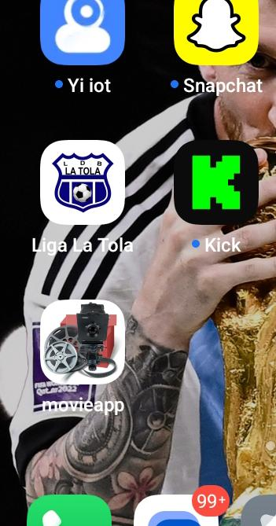
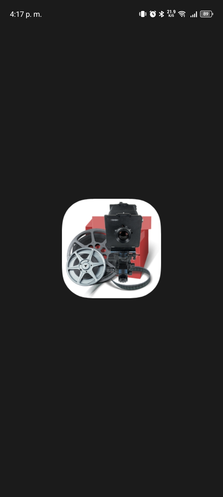
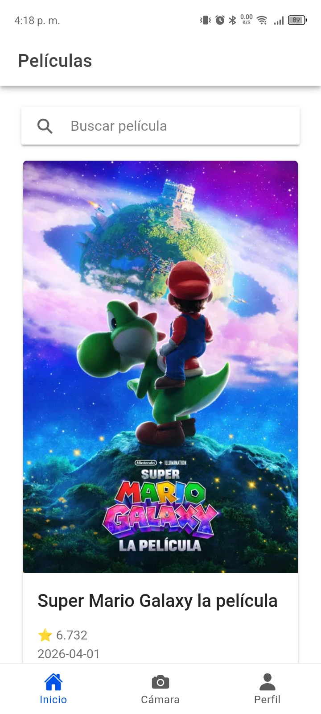
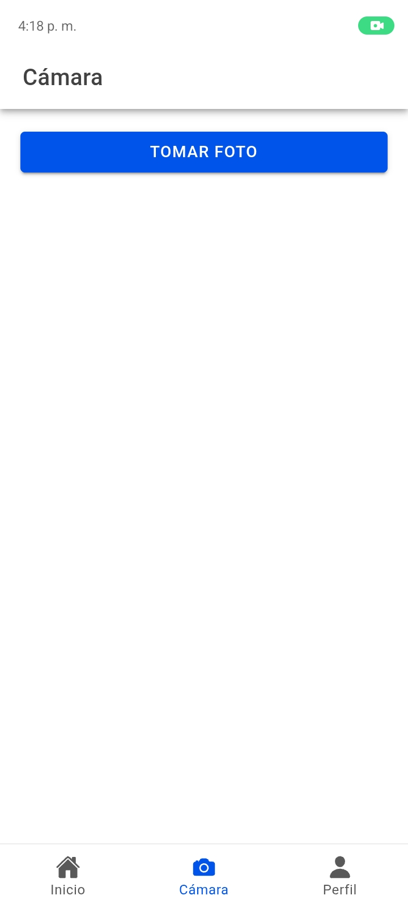
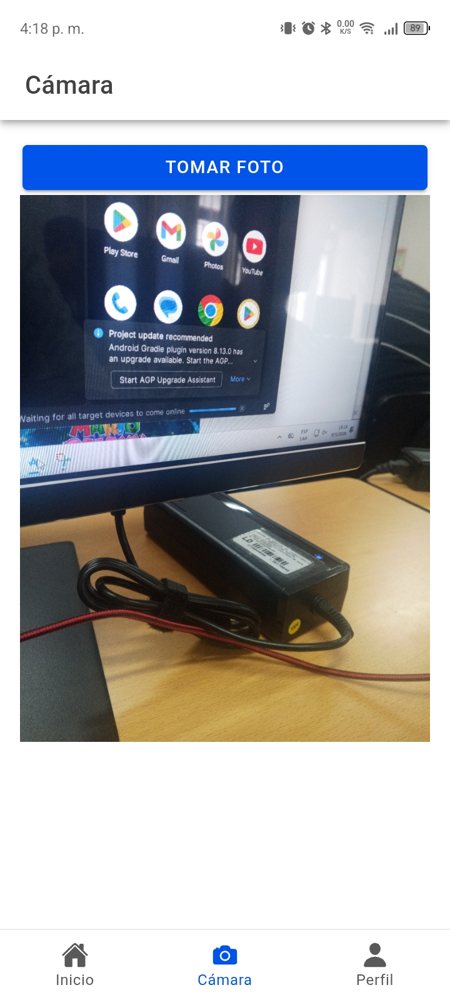
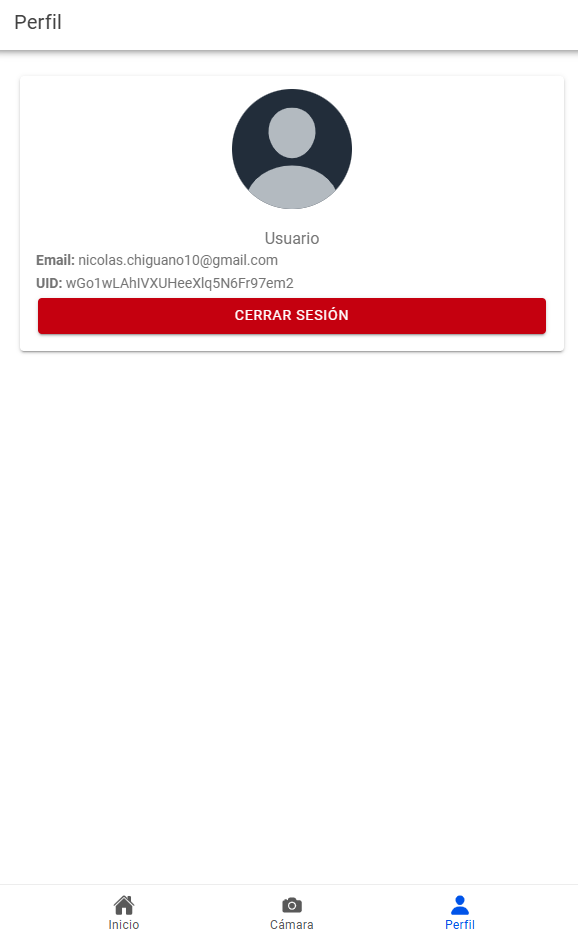

# MovieApp 🎬

## Nombre del proyecto:
MovieApp - Aplicación móvil de películas

---

## Tema seleccionado:
Aplicación móvil desarrollada con Ionic y Angular que permite:

- Registro e inicio de sesión con Firebase Authentication
- Visualización de películas populares
- Búsqueda de películas
- Visualización de detalles de cada película
- Uso de cámara del dispositivo
- Almacenamiento local de fotografías
- Perfil de usuario autenticado

---

## API utilizada:
- TMDB API (The Movie Database)

API oficial:

[TMDB API](https://developer.themoviedb.org)

---

## Tecnologías:

- Ionic Framework
- Angular
- Capacitor
- Firebase Authentication
- TypeScript
- HTML
- SCSS
- TMDB API

---

## Instrucciones de instalación:

### 1. Clonar el repositorio

```bash
git clone https://github.com/NicolasCh25/Prueba_AppsMoviles_Nicol-s.Chiguano.git
```

---

### 2. Entrar al proyecto

```bash
cd Prueba_AppsMoviles_Nicol-s.Chiguano
```

---

### 3. Instalar dependencias

```bash
npm install
```

---

### 4. Ejecutar la aplicación

```bash
ionic serve
```

---

## Instrucciones de ejecución:

### Ejecutar en navegador

```bash
ionic serve
```

La aplicación se abrirá en:

```text
http://localhost:8100
```

---

### Ejecutar en Android

Instalar Capacitor Android:

```bash
npm install @capacitor/android
```

Agregar Android:

```bash
npx cap add android
```

Sincronizar proyecto:

```bash
npx cap sync
```

Abrir Android Studio:

```bash
npx cap open android
```

---

### Generar APK

En Android Studio:

```text
Build → Build Bundle(s) / APK(s) → Build APK(s)
```

---

## Capturas:

### Ícono personalizado


---

### Splash Screen


---

### Login


---

### Películas


---

### Cámara


---

### Cámara y fotografía guardada


---

### Perfil de usuario


---

## Uso de IA:

Se utilizó inteligencia artificial para apoyo en:

- Corrección de errores
- Implementación de funcionalidades
- Integración con APIs
- Implementación de Firebase Authentication
- Configuración de Capacitor
- Uso de cámara y almacenamiento local
- Diseño de componentes Ionic

### Prompts utilizados:

- "Agrega un buscador de películas usando TMDB API"
- "Corrige errores de rutas en Ionic Angular"
- "Implementa autenticación con Firebase"
- "Haz que las fotos se guarden localmente"
- "Configura la cámara con Capacitor"
- "Agrega ion-toast, ion-alert e ion-modal"
- "Genera splash screen e ícono personalizado"
- "Corrige errores de Angular standalone components"

---

## Autor:

### Nicolás Chiguano

GitHub:

[Repositorio del proyecto](https://github.com/NicolasCh25/Prueba_AppsMoviles_Nicol-s.Chiguano.git)
